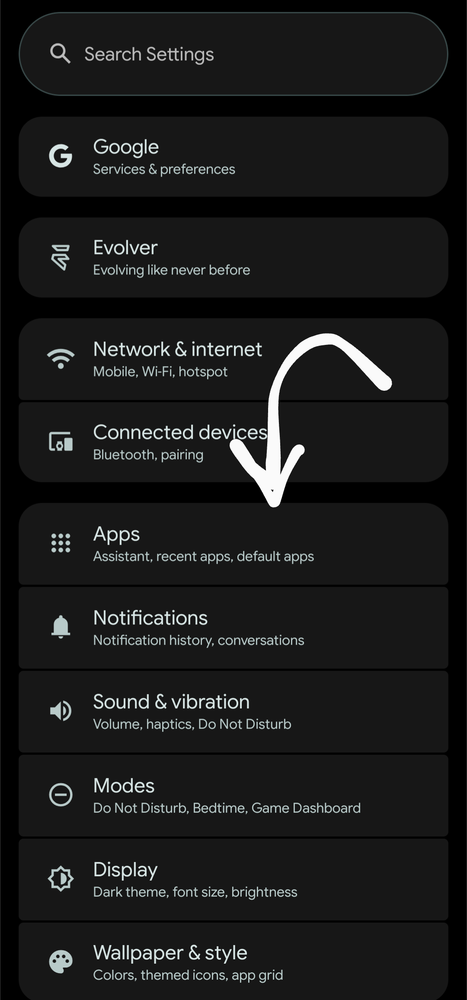
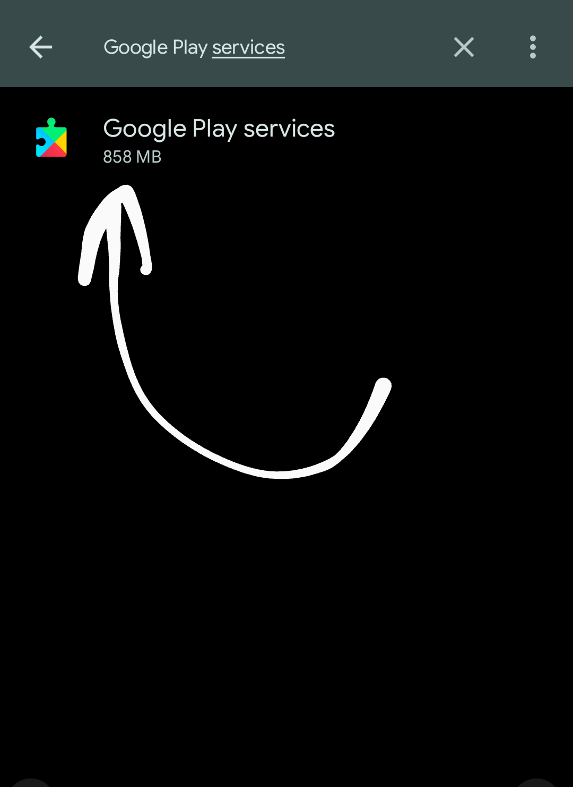
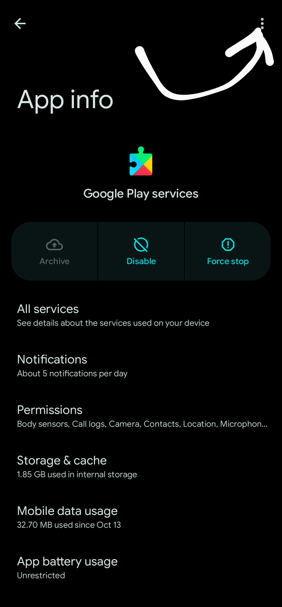
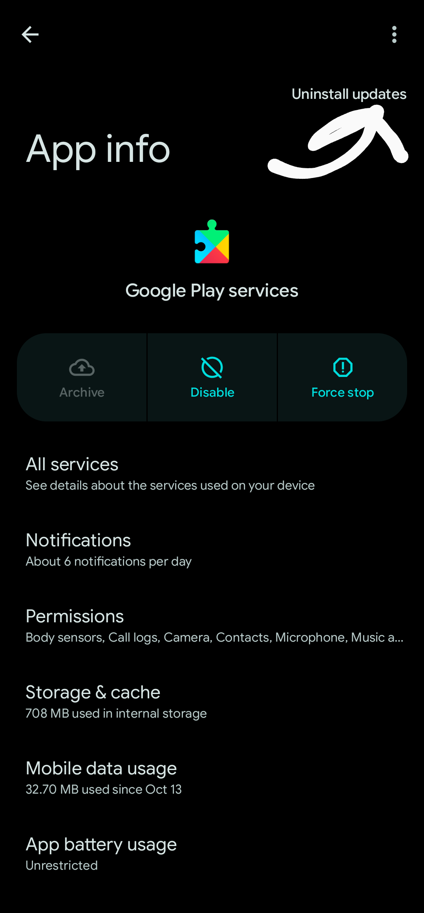
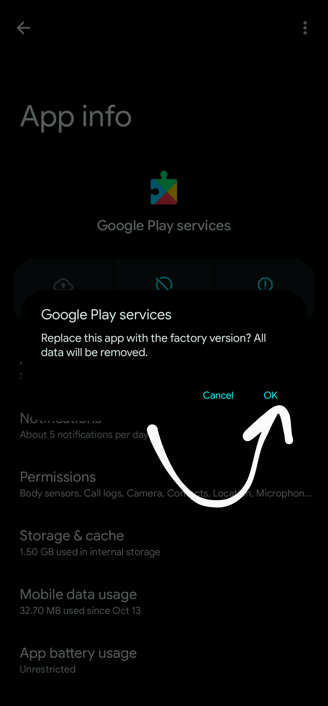

# 🗑️ GMS uninstaller
`by readonlynux`

This module allows you to uninstall GMS (Google Mobile Services) applications using the systemless structure of Magisk.

> **❌ NOT SUPPORTED:**  **Not supported on Android 10 and below devices**. Use this flashable zip file only for **ANDROID 11 AND ABOVE! I AM NOT RESPONSIBLE FOR ANY DAMAGES THAT MAY OCCUR!**

> **⛔ WARNING:** This module removes GMS, but removing GMS applications can **CAUSE SYSTEM-WIDE INSTABILITY**. When removing GMS applications, find an alternative or remove all GMS-connected applications to avoid causing system issues.

> ⚠️ This module **may not be stable**. If you encounter any errors, please report them in the issue section.

## 📜 Legal Informations

**I AM NOT RESPONSIBLE FOR ANY PROBLEMS THAT MAY OCCURR! Use at your own risk!**

# 📙 How to use?

Before installing the module;

> ❓ The reason we do this is to completely delete the applications so that even if you install the module, they will still exist in the system unless you uninstall their updates.

1. Open the **Settings** and press **Apps** section.

2. Click  **See all apps**

3. Type the names of all the apps you want to remove.

4. Go to app information and click on the 3 dots in the top right corner.

5. Press **Uninstall updates**

6. And uninstall

# 🔹 GMS uninstaller's

----

## 🗑️ GMS uninstaller All

This version allows you to delete all GMS.

## ♻️ They will be deleted;

- Google Play Services
- Google Services Framework
- Google Play Store

## 🗑️ GMS uninstaller without Google Play Store

This version allows you to delete GMS applications outside of the Google Play Store.

## ♻️ They will be deleted;

- Google Play Services
- Google Services Framework

# ❓ FAQ

### ❌ I want a more advanced deletion system apps.

- This module is designed to remove GMS only at a basic level. If you want a more comprehensive deletion system apps, you can use the following application;
    - De-Bloater [GitHub](https://github.com/sunilpaulmathew/De-Bloater) | [F-Droid](https://f-droid.org/packages/com.sunilpaulmathew.debloater/)
